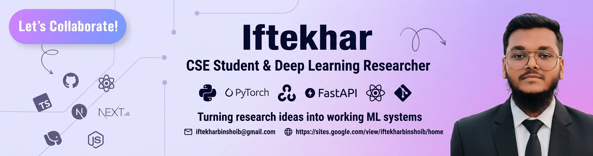

  

  

  

 

<h2>🚀 About Me</h2>

- 🎓 First-year **Computer Science and Engineering** student at **American International University-Bangladesh (AIUB)**
- 🔬 Focused on **Deep Learning research**, **NLP**, and applied **Computer Vision**
- 📄 Co-authored a paper submitted to **ICCA 2026** on urban waste detection (YOLO / RT-DETR / Faster R-CNN)
- 🧬 Currently working on graph neural networks for antimicrobial-resistance gene classification and a rheumatoid-arthritis gene-expression thesis
- 🌐 Also sharpening full-stack fundamentals through Programming Hero's **AI-driven Full-Stack Web Development** course (HTML, CSS, JS, TS, React, Next.js, Express.js, MongoDB)
- 🛠️ Builds practical, ML-powered systems on the side: face verification, crop recommendation, and CAPTCHA automation
- 🌍 Based in Dhaka, Bangladesh

 

<h2>🧪 Featured Projects & Research</h2>

| Project | Description |
|---|---|
| 🗑️ **Urban Waste Detection** | Object detection with YOLO26 / RT-DETR-L / Faster R-CNN on a self-collected, 12k-image, 9-class Bangladesh waste dataset, with Grad-CAM++ / Eigen-CAM explainability. Paper submitted to ICCA 2026. |
| 🧬 **ARG Classification (GNN)** | Research proposal applying GCN / GAT / GraphSAGE / GIN to antimicrobial-resistance gene classification via protein/gene similarity graphs. |
| 🩺 **RA Gene Expression Thesis** | ML-ready datasets built from the GSE93272 microarray dataset for rheumatoid-arthritis diagnosis and disease-activity prediction. |
| 🌾 **Crop Recommendation System** | ML model + FastAPI backend + ESP32 sensors, built for a Bangladesh-specific precision-agriculture research paper. |
| 🔐 **Face Verification System** | Real-time face verification (YuNet + SFace) that triggers an Arduino-controlled door lock over serial. |
| 🔡 **CAPTCHA Recognition** | OCR + Random Forest pipeline that automates CAPTCHA-solving for the AIUB student portal. |
| 💻 **Linux Terminal Simulator** | Browser-based Linux terminal simulator with a virtual filesystem, plugin-based commands, and an optional Learning Mode. |

> 💡 Pin these on your profile (top of your profile page → Customize your pins) once each repo is live, so the table links up with real projects.

 

<h2>🛠️ Tech Stack</h2>

 

**Languages**

**Full-Stack Web Development**

**ML / Deep Learning / Computer Vision**

**Tools & Platforms**

 

<h2>📊 GitHub Statistics</h2>

 

  
  

  

 

  <picture>
    <source media="(prefers-color-scheme: dark)" srcset="https://raw.githubusercontent.com/IFTI737/IFTI737/output/github-contribution-grid-snake-dark.svg">
    <source media="(prefers-color-scheme: light)" srcset="https://raw.githubusercontent.com/IFTI737/IFTI737/output/github-contribution-grid-snake.svg">
    
  </picture>

 

<h2>📫 Connect With Me</h2>

 

  
  
  

